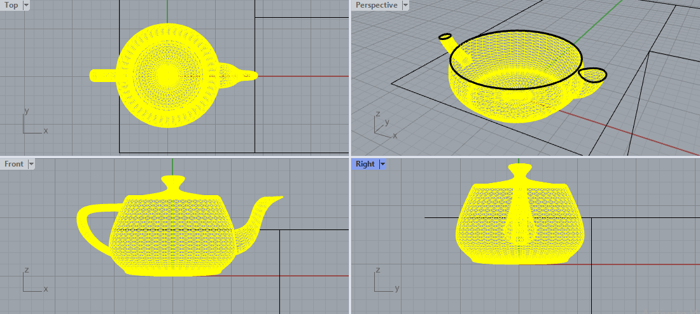
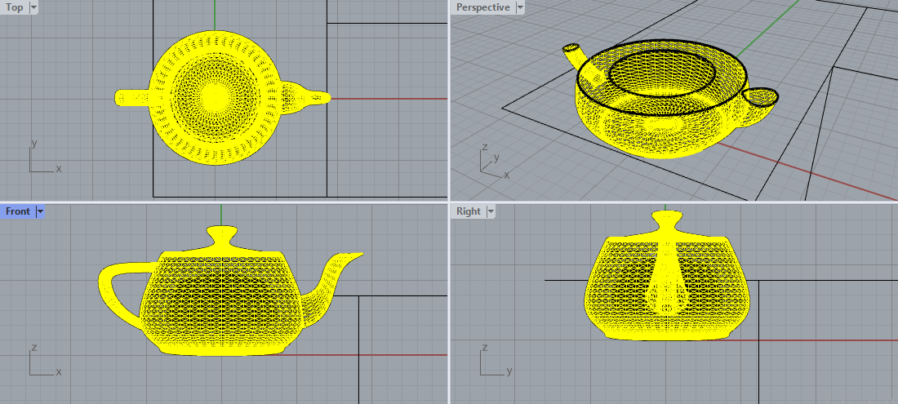

# Hollow 

A Rhino3D plugin sponsored by [Nano3DTech](https://nano3dtech.com/).

# Installation

Simply visit the [plugin page](https://www.food4rhino.com/en/app/hollow). Then log in and push the `install` button in front of latest released version. Or alternatively, do these:

1. Use `PackageManager` command on Rhino3D commandline.
1. Search for plugin name i.e. `Hollow`.
1. The plugin will be listed through the package manager UI.
1. Click the install button.

# How to use it

Once the plugin is installed, its commands can be accessed by typing the plugin name on command line. Start typing `Hollow` on Rhino3D command line to auto complete the plugin commands.

## User guide

This video demonstrates how to use the plugin command after installation:

## Screenshots

### Original model

### Hollowed model

# Commands

This plugin offers a `HollowMesh` command to hollow out your 3D model.

## `HollowMesh` command

This command helps you hollow out the 3D model. The input parameters are:

* To have a gyroid infill or not.
* Thickness.
* Accuracy.

It employs the signed distance field or SDF under the hood.
